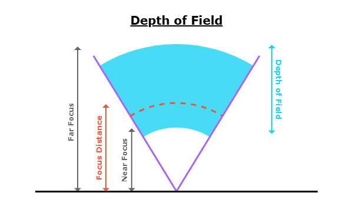
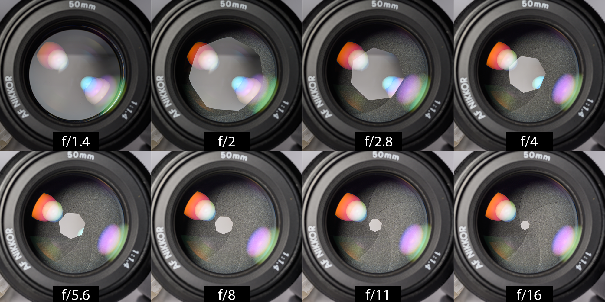

# Camera Lens Depth of Field Study
by Harper Dowd

This project was made to study the effects of camera lens depth of field using Python to help model and visualize some of the abstract physical concepts. 

-- Project Status: In Development

  

## Table of Contents
- Introduction
  - Focal Length & Diagonal Angle of View
  - Aperture
- Depth of Field Overview
  - Hyperfocal Distance
  - Near & Far Focus Limits
- Controlling Depth of Field
  - Subject Distance vs. Depth of Field
  - Aperture vs. Depth of Field
  - Focal Length vs. Depth of Field
- Additional Considerations
- References

## Project Deliverables
- [Camera Lens Depth of Field Study (PDF Form)](exports/cameraLensEffectsDemonstration.pdf)
- [Camera Lens Depth of Field Study (HTML form)](exports/cameraLensEffectsDemonstration.html)

## Example Graphics & Figures

  

  <em>50mm Lens with Aperture set to every full stop between f/1.4 and f/16</em>

 

  

  <em>105mm - f/4 - 1/60</em>

## Contact
- Portfolio: <https://www.harperdowd.com>
- LinkedIn: <https://www.linkedin.com/in/harper-dowd>
- E-mail: harperdowd@gmail.com

